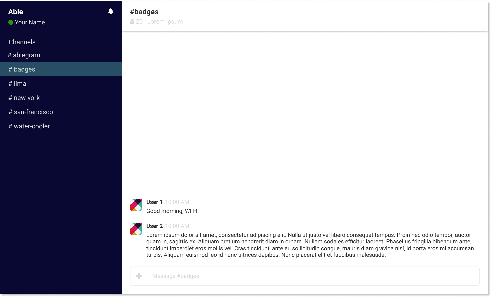

# CSS 1 Pairing Session Exercise

Your task is to implement the styles for the HTML skeleton to be similar to this image:



## Color palette

These are the colors that were used for the mockup. You are free to change the colors.

```
aside-color: #090833;
text-primary-color: #333333;
text-secondary-color: #d7d7d7;
channel-primary-color: #274e64;
```
